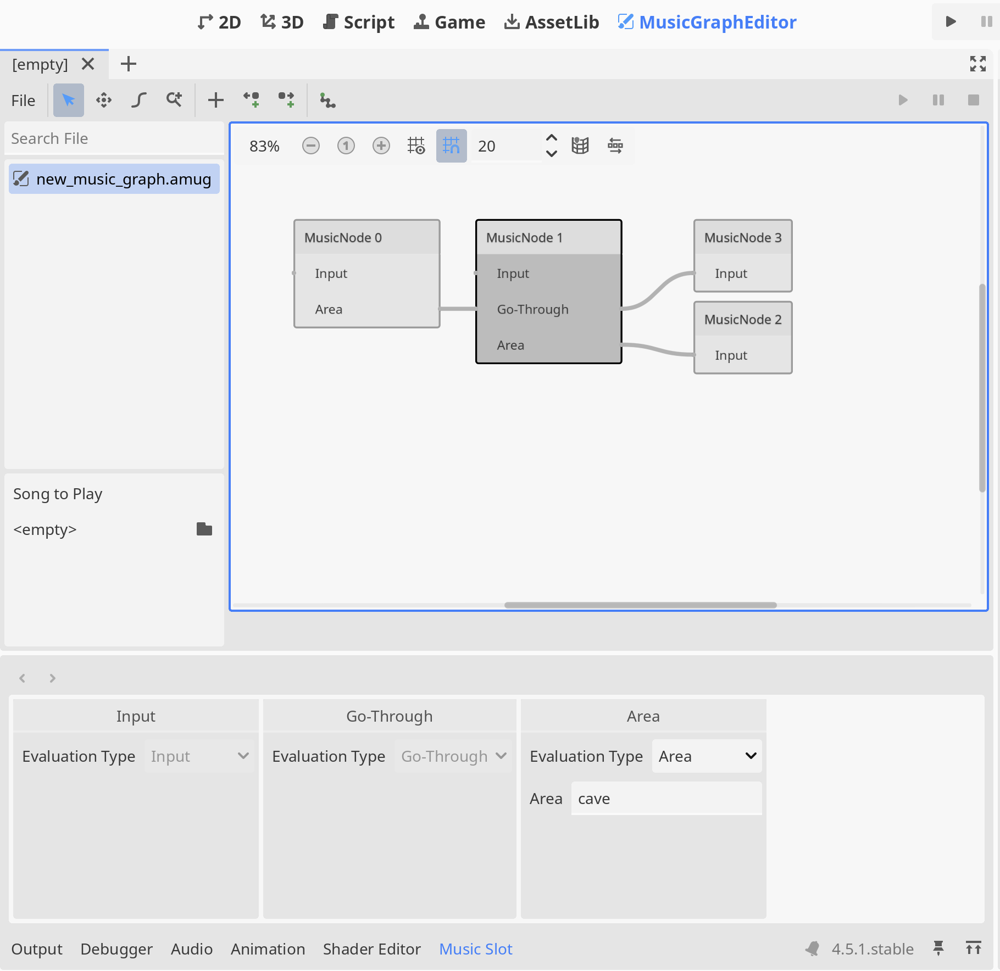

# Adaptive Music using Graph

This is an under-developing Adaptive Music Godot Plugin.

It utilise the graph-node representation on music segment,
and allows users to set multiple strategy for horizontal layering.

## Declaration

This plugin does not directly use AI generated code.
Instead, it uses suggestions given by AI,
 and each code is checked.

This plugin uses Godot Editor's icon.

## Directory Structure

* `core/`: The essential data type and shared logic.
* `editor/`: Only runs within Godot editor.
* `runtime/`: Only runs in game, or being used for game logic.